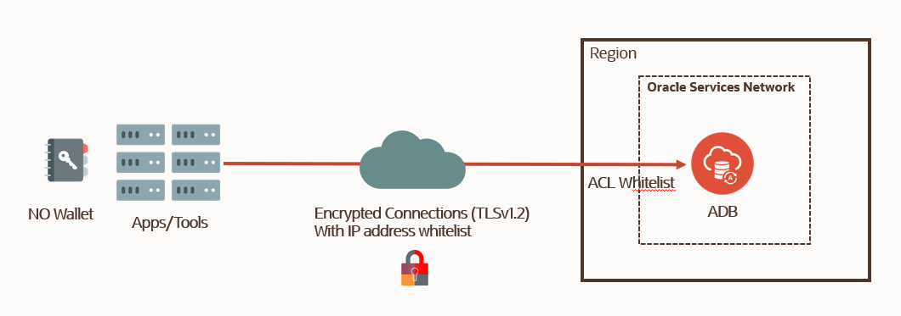
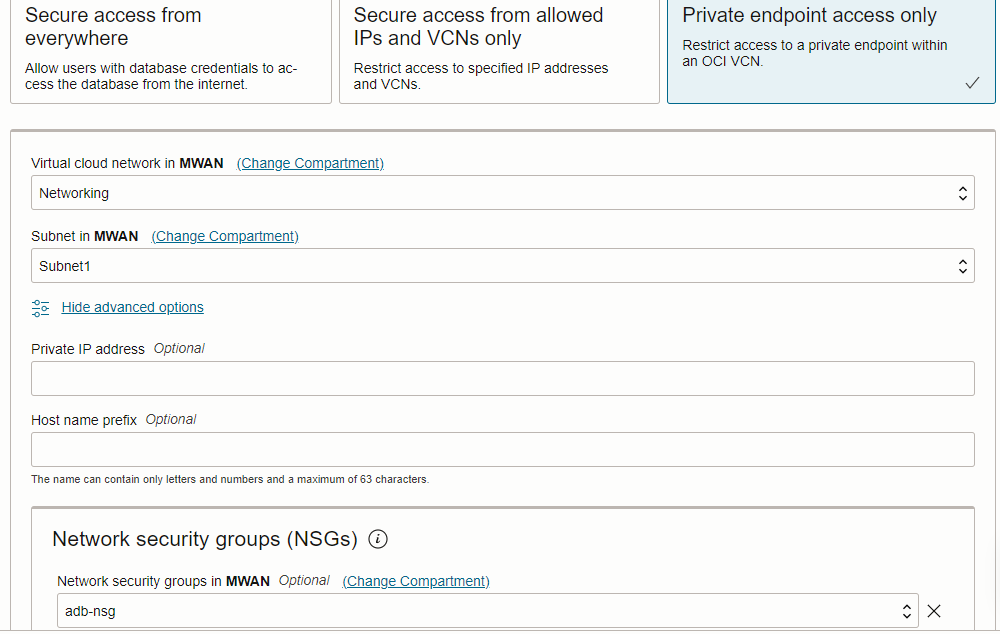
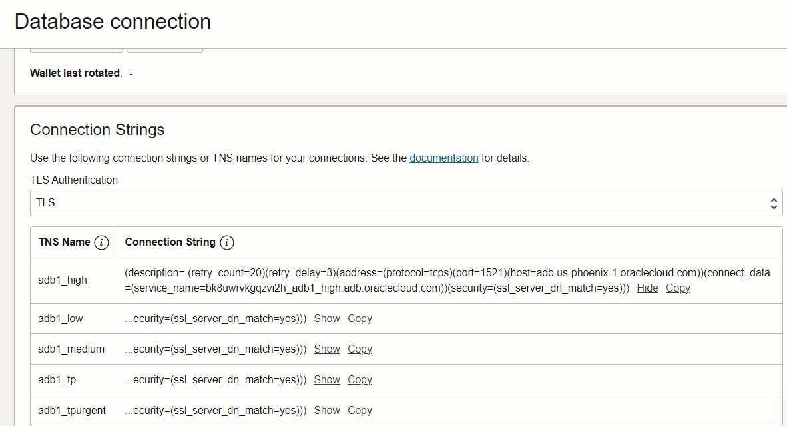

## Connect with one way TLS without a Wallet

You can connect your application to ADB without the wallet (mTLS) using one way TLS.  There is no need to download the ADB wallet for TLS network access.  You can connect your application securely from a public connection by setting ACLs or connect privately inside the VCN where your application is deployed by configuring a private endpoint.  Both are configured during the ADB provisioning but you can also change and update the network access after provisioning.

### ACL Access

1. To configure the access control list (ACL) select Secure access from allowed IPs and VCNs only.  Select the IP notation type.  It can be IP Address, CIDR Block, or VCN.  
   
2. Enter your values for the application connecting to ADB.  It could be from a list of IP addresses, a CIDR block, or your VCN where the application will connect to ADB.

3. Uncheck the box Require mutual TLS (mTLS) authentication.

### Private Endpoint Access

Applications deployed on an OCI VCN can access ADB from private endpoints.  To do this you must configure a network security group (NSG) and define security rules for access to ADB.  The source CIDR should be where your application is deployed, and the destination port should be 1521. An example is shown below. For more information about NSG, see [here](https://docs.oracle.com/en-us/iaas/Content/Network/Concepts/networksecuritygroups.htm).

Once you have configured the network security group, go back to ADB and configure network access with private endpoint.

1. Select Private endpoint access only.

2. Select your VCN and the subnet for the private endpoint.

3. Uncheck the box Require mutual TLS (mTLS) authentication.
   
4. Show advanced options and select your network security group.

### Get the TLS Connection string

Your application can now use a TLS connection string to ADB without a wallet. 

1. Click on Database connection from the ADB details.
   
2. Scroll down and select TLS in the TLS Authentication dropdown.
   
3. Copy the connection string you want to use to connect to ADB.  Note the port is 1521 for TLS connections to ADB.  mTLS or wallet connection uses 1522.

You're now ready to go back to your application and use the TLS connection string to connect to ADB.

 

