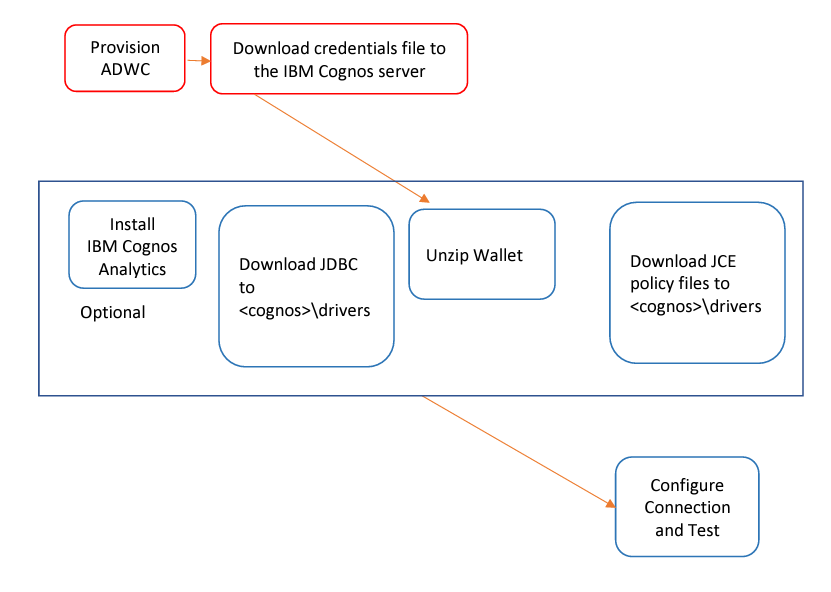
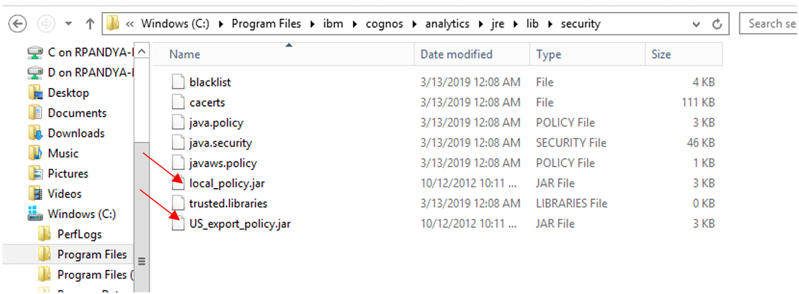
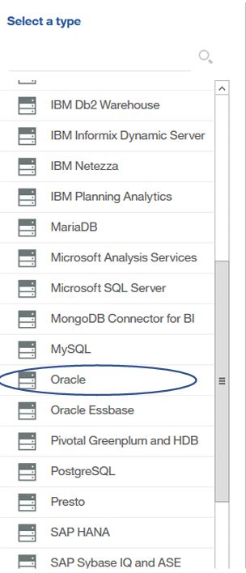
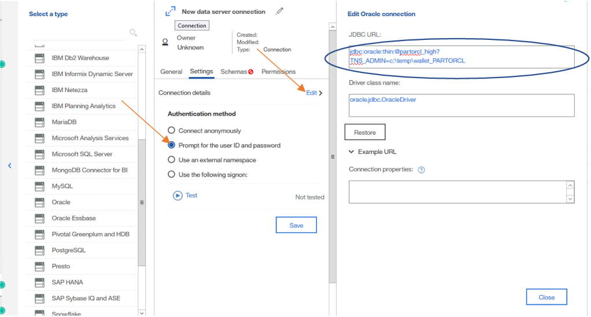

# Creating a connection from IBM Cognos Analytics Server to Oracle Autonomous Data Warehouse(ADW)

| Validation Matrix  | Version  |
| ------------- | ------------- |
| AIBM Cognos  Analytics  | Cognos 11.0.x and higher.   and JDBC 11.1. X or  higher  |
| JDBC Drive  | Oracle JDBC Driver 18.3  |

### **Prerequisites**

- Required access and credits to provision ADW instance on Oracle Cloud.  To provision ADW, see [here](https://docs.oracle.com/en/cloud/paas/autonomous-database/adbsa/autonomous-provision.html#GUID-0B230036-0A05-4CA3-AF9D-97A255AE0C08).
- Oracle JDBC Thin driver is downloaded on the app server. To download and configure, see [here](lab?=jdbc-thin).
- If ADW is already configured you have the ADMIN user password and ADB Wallet is [downloaded](lab?=wallet) on app server.

## **Configure the Connection**

The following diagram explains the flow of steps to be performed.

## Step 1: Install IBM Cognos Analytics Software

If you have an existing Cognos Analytics software installed, then you can jump to Step 2 which
describes the steps to configure ADWC as a target.
To install Cognos Analytics software, please refer to the [Install Documentation](https://www.ibm.com/support/knowledgecenter/SSEP7J_11.0.0/com.ibm.swg.ba.cognos.cbi.doc/manuals.html).
Note that the Cognos Analytics server can run on more than one server. You will have to
download and configure on all the servers following the steps below.

## Step 2: Configuring IBM Cognos Analytics to connect to ADW (Windows OS)

1. Oracle recommends using the latest Oracle JDBC Driver version 18, 19 and 21 drivers to connect to ADWC. You may download the driver files from Oracle Technology Network
and follow instructions described below to find out which files to download.

2. Cognos supports TNS based JDBC Thin connection to ADW using the TCPS connection
protocol.

3. Download the following files from the [OTN JDBC downloads page](https://www.oracle.com/database/technologies/appdev/jdbc-ucp-183-downloads.html):

    - ojdbc8.jar (Oracle JDBC driver jar file)
    - oraclepki.jar (Additional jar required to access Oracle Wallets from Java)
    - osdt_cert.jar (Additional jar required to access Oracle Wallets from Java)
    - osdt_core.jar (Additional jar required to access Oracle Wallets from Java)

      

      These files need to be placed into the Drivers Folder of each of the Cognos Analytics server installations. The typical directory for the Drivers is `<cognos>\drivers` directory assuming you have installed Cognos Analytics server on Windows OS.  

      

      IBM Cognos Analytics needs to run in a JRE environment and needs JCE unrestricted policy files installed. Please use the IBM JRE. Make sure to update your JRE to the latest version see why [here](https://www.oracle.com/java/technologies/javase/8u151-relnotes.html)

      IBM  JRE : Policy files are available from the [IBM Download Page](https://www.ibm.com/docs/en/iis/11.7?topic=certificates-downloading-installing-unrestricted-jce-policy-files).

      Once JCE policy files are downloaded, place the `local_policy.jar` and `ux_export_policy.jar` files in the JRE Library Security sub directory. Usually the path to that directory on Windows OS is `<cognos>\analytics\jre\lib\security`

      

      Restart the Cognos Analytics Server and now you are ready to configure a connection to ADWC.

## Step 3: Configure a new Data Server Connection

1. Log into the Cognos Analytics Server to configure a new Data Server Connection. Choose  Manage -> Data Server Connection -> New Data Server Connnection

  

2. Select database as Oracle

  

3. Under the settings section, choose Prompt for the user ID and password. Click on Edit to create a JDBC Thin URI using the services name from the tnsnames.ora file. Your will find this information in th etnsnames.ora file that is a part of the credentials zip file you had earlier unzipped in the TNS_ADMIN directory.

  

4. Before saving your connection, test the connection for success.

  

**You have successfully configured IBM Cognos Analytics to connect to ADWC!**

## **Acknowledgements**
* **Author(s)** - Vijay Balebail - Director Product Management
* **Contributor(s)** - Blake Hendricks- ADB Product Manager
* **Last Updated By/Date** -  Blake Hendricks May 2023
