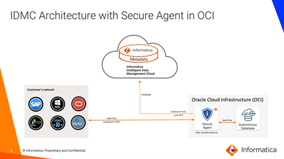
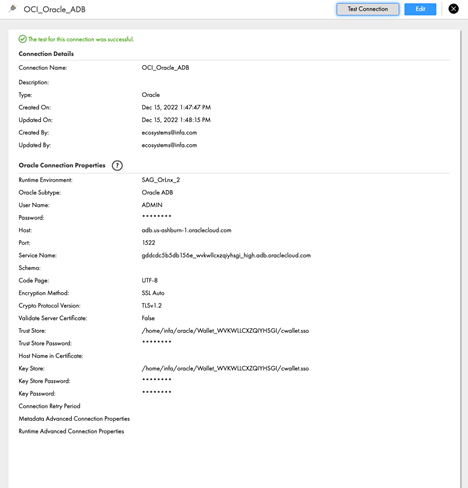

**Introduction**

This guide shows you how to configure Informatica Data Management Cloud connectivity to Oracle Autonomous Database (ADB).  It describes how to connect Oracle Autonomous Database using the wallet or mTLS.  If you want to connect without the wallet click [here](https://oracle-samples.github.io/adb-connectors/common/tls-no-wallet/workshops/freetier/).

This document provides an overview of the configuration steps to create a connection in IDMC to Oracle Autonomous Database (OADB) as target endpoint.

There are two parts to IDMC.  
-	The control plane where you design mappings or data pipeline.  The mapping metadata resides within the control plane repository in IDMC.  
-	The second part is the execution plane.  The execution plane is the secure agent which resides in customer’s premises or in Oracle Cloud (OCI).  The secure agent is the processing engine that read from data source, perform transformations, and write to the target.   

The diagram below provides an architecture overview.

## **Prerequisites**

- If ADW or ATP is already provisioned and you have the ADMIN user password and ADB Wallet is downloaded on app server and the wallet password.
- Login credentials for the Informatica Intelligent Data Management Cloud OR Sign up for [IDMC trial organization](https://dm1-us.informaticacloud.com/ma/register)
- Deploy a secure agent from [OCI Marketplace](https://cloudmarketplace.oracle.com/marketplace/en_US/listing/131666415)

## **Configure the Connection**

### Step 1: Download wallet and Oracle Instance Client
1.	Upload the wallet.zip file to the secure agent machine
2.	Download Oracle Instant Client, and then upload it to the secure agent machine

    Recommendation:
    -	Create a folder called oracle (e.g. /home/infa/oracle) and put wallet and instant client files into that folder
    Notes:
    -	Deploying a secure agent from OCI Marketplace will provision a Linux machine with a secure agent configured.  
    -	Secure agent is installed with ‘infa’ Linux user and group.
    -	Default login to Linux machine uses ‘opc’ Linux user.  If wallet and Instant client files are uploaded using ‘opc’ user, make sure ‘infa’ user has read access to those files.
    -	If there are multiple secure agent deployed, this step needs to be repeated for each   

### Step 2: Unzip Wallet file and update sqlnet.ora for wallet location
1.	Unzip Oracle instant client .zip file.  Extracted files should be in /home/infa/oracle/instantclient
2.	Unzip wallet .zip file.  Extracted files should be in /home/infa/oracle/Wallet\_xxx
3.	Edit sqlnet.ora file in wallet folder and replace “?/network/admin” with the name of the folder containing the wallet file.

    Example:   
    WALLET\_LOCATION = (SOURCE = (METHOD = file) (METHOD_DATA = (DIRECTORY="/home/infa/oracle/Wallet\_DB202212151000"))) SSL\_SERVER\_DN\_MATCH=yes)

4.	Copy sqlnet.ora and tnsnames.ora from wallet directory to instantclient/network/admin folder.

### Step 3: Configure New connection in IDMC
1. Login to *Informatica Intelligent Data Management Cloud*.
2. Select **Administrator**.
3. Click **Connections** and then **New Connection**.
4. Configure the connection using the following properties:

      |Property	|Description|
      |:----------|:-------------|
      |Connection Name|	Name for the connection|
      |Description|	Description|
      |Type| Oracle|
      |Runtime Environment|	Select the secure agent group where the wallet and instant client reside. |
      |Oracle Subtype | Select Oracle ADB|
      |User Name 	|Username for Oracle ADB instance|
      |Password 	|Password for Oracle ADB instance|
      |Host 	|ADB hostname; from tnsnames.ora file|
      |Port 	|ADB port number; from tnsnames.ora file|
      |Service Name 	|ADB service name; from tnsnames.ora file|
      |Code Page |  UTF-8|
      |Encryption Method| 	SSL Auto|
      |Crypto Protocol Version 	|TLSv1.2|
      |Validate Server Certificate 	|False|
      |Trust Store 	|Directory path and filename to cwallet.sso file|
      |Trust Store Password 	|password for the wallet|
      |Key Store 	|Directory path and filename to cwallet.sso file|
      |Key Store Password 	|password for the wallet|
      |Key Password 	|password for the wallet|
5. Click **Save**.
6. Click **Test Connection** to test the connection. Make sure all fields are entered correctly and test result is successful.

    

## **Additional Reference**
1.	YouTube video: [Setting Up an Oracle Autonomous Database Connection with a Secure Agent in IICS](https://www.youtube.com/watch?v=4tCKP6D1myo)
2.	Documentation: [Oracle Autonomous Database connector](https://docs.oracle.com/en/cloud/paas/autonomous-database/adbsa/connect-autonomous-database.html)
3.	Documentation: [Secure Agent Installation](https://docs.informatica.com/cloud-common-services/administrator/current-version/runtime-environments/secure-agent-installation.html)
4.	[Analytics Platform Reference Architecture](https://docs.oracle.com/en/solutions/informatica-on-oci/index.html#GUID-6A097301-4F34-40B4-8816-76F71362EAFD)
5.	Oracle LiveLabs [Transform Data with Informatica Data Integration](https://apexapps.oracle.com/pls/apex/dbpm/r/livelabs/view-workshop?wid=3394)

## **Acknowledgements**
* **Author(s)** - Eddy Widjaja (Informatica), Rajeev Rumale (Oracle)
* **Contributor(s)** - Vijay Balebail (Oracle)
* **Last Updated By/Date** -  2/10/2023
