# Connecting Microsoft SQL Server Analysis Services to Oracle Autonomous Databases and On-premises Databases


This step-by-step tutorial guides how to configure Microsoft SQL Server Analysis Services (SSAS) connectivity to Oracle Autonomous Database (ADB) and on-premises databases. These instructions use unmanaged Oracle Data Provider for .NET (ODP.NET) for data access as required by SSAS. They work for on-premises database and both dedicated and shared infrastructure ADB. The instructions for on-premises databases setup also apply to Oracle Database Cloud Services and Oracle Exadata Cloud Service.

## Overview
These are the general steps to setup Oracle database connectivity with SSAS:
1. Provision Oracle database or ADB
2. Download database credentials to Windows client
3. Install Visual Studio and Microsoft Analysis Services extension on Windows client
4. Install and configure ODP.NET on Windows client
5. Validate SSAS connects to Oracle database or ADB

## Prerequisites
This document assumes that an on-premises Oracle database or ADB, such as Autonomous Data Warehouse (ADW) or Autonomous Transaction Processing (ATP), or Autonomous JSON Database (AJD) has been provisioned and Visual Studio with an SSAS extension is installed on a Windows client. The Windows machine can be on-premises or in the cloud, such as Oracle Cloud Infrastructure or Azure.

Connecting to Oracle databases on-premises and ADB are similar. This tutorial will note the differences between them when setting up connectivity.

If using ADB, you will need access to the Oracle Cloud Console that has access to your ADB instance. Below is a screenshot from the cloud console to a database named ADWPTR.


SSAS uses unmanaged ODP.NET (Oracle.DataAccess.Client) for Oracle database connectivity. 32-bit processes can use 32-bit unmanaged ODP.NET. 64-bit processes can use 64-bit unmanaged ODP.NET.

In Visual Studio, some parts of SSAS are 64-bit based and some are 32-bit. Microsoft recommends installing both 32-bit and 64-bit database client drivers to use the full complement of SSAS functionality.

This tutorial uses Visual Studio 2022 and Integrated Workspace to demonstrate connectivity to Oracle Database. SSAS Integrated Workspace is 64-bit, which means it uses 64-bit unmanaged ODP.NET. 

32-bit ODP.NET instructions are included in this tutorial for completeness. However, installing 32-bit ODP.NET is not required to complete the tutorial’s connectivity exercise.


## Oracle Client Installation and Setup Steps 

For ADB, go to the cloud console screen for the ADB instance you will connect to. Start your ADB instance. Click on the “DB Connection” button. Download the corresponding ADB credentials zip file to the system that has Visual Studio/SSAS installed. These credential files (cwallet.sso, tnsnames.ora, and sqlnet.ora) will be used to connect SSAS to ADB. 
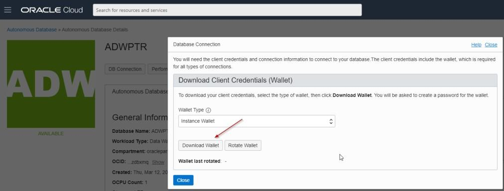


### For on-premises databases

The credential files required will depend on your database server setup. Typically, ODP.NET requires tnsnames.ora and sqlnet.ora to be accessible to connect to the database server. These files can be copied from another Oracle database client that connects to the target database server. 

Alternatively, an Easy Connect or Easy Connect Plus string can be used in lieu of credential files for on-premises databases. For example, the SSAS “Server” configuration setting can accept an Easy Connect string with the following format: `“<DB hostname>:<Port>/<Service Name>”`. If you use Easy Connect (Plus), you can skip the credential file downloading and setup steps in this tutorial.

Place the Oracle database credentials on your Windows machine into a directory (e.g., C:\data\wallet). This machine is where SSAS is or will be installed on. For ADB, the credentials have been downloaded into a zip file that you will unzip into this directory. Note the directory location for use in upcoming steps.


 
### ADB only
If you are connecting to one ADB instance, open the sqlnet.ora configuration file in the credentials directory in a text editor. You will see the following line: 
`WALLET_LOCATION = (SOURCE = (METHOD = file) (METHOD_DATA = (DIRECTORY="?/network/admin")))`
 
Set the DIRECTORY value to the ADB wallet directory location, such as: 

`WALLET_LOCATION = (SOURCE = (METHOD = file) (METHOD_DATA = (DIRECTORY=C:\DATA\WALLET)))`
 
If you are connecting to multiple ADBs from the same machine with a different wallet for each, add the parameter MY_WALLET_DIRECTORY to each connect descriptor’s specific wallet location in tnsnames.ora. For example: 
```
adwptr_high = (description=(retry_count=20)(retry_delay=3)(address=(protocol=tcps)(port=1522)
(host=<host name>)) (connect_data=(service_name=<service name>))
(security=(ssl_server_cert_dn="CN=adwc.uscom-east-1.oraclecloud.com, OU=Oracle BMCS US, O=Oracle Corporation, L=Redwood City, ST=California, C=US")(MY_WALLET_DIRECTORY=C:\DATA\WALLET\ADWPTR))) 

adwbi_high = (description=(retry_count=20)(retry_delay=3)(address=(protocol=tcps)(port=1522)
(host=<host name>))(connect_data=(service_name=<service name>))
(security=(ssl_server_cert_dn="CN=adwc.uscom-east-1.oraclecloud.com, OU=Oracle BMCS US, O=Oracle Corporation,L=Redwood City, ST=California, C=US")(MY_WALLET_DIRECTORY=C:\DATA\WALLET\ADWBI))) 
```
After making your changes, save the file. 

Unmanaged ODP.NET can be downloaded for free. From the [Oracle Client for Microsoft Tools page](https://www.oracle.com/database/technologies/appdev/ocmt.html), click on the download link, “64-bit Oracle Client for Microsoft Tools”. 
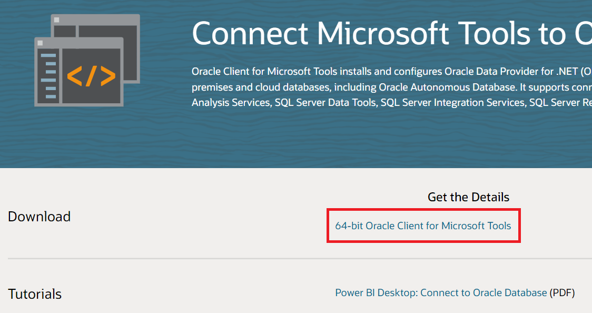
 

Log on to the Oracle website. In the “Platforms” drop down, select 64-bit or 32-bit Windows. 

### 64-bit SSAS-Specific Setup

64-bit SSAS requires 64-bit ODP.NET. If you are using 64-bit, download **Oracle Client for Microsoft Tools**. 

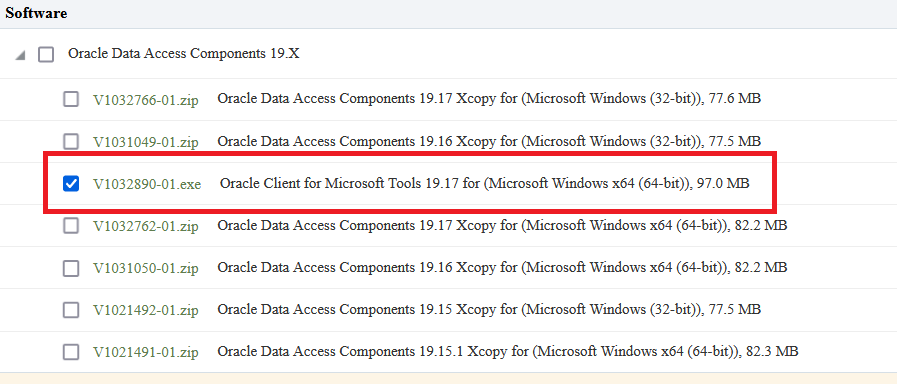

Look for **Oracle Client for Microsoft Tools.exe**. Click the EXE link on the left side to begin the download process. Choose the local directory to download the executable to and click “Save”. You should now see the download locally. 


Double click the icon to begin the install process. Next, click the “Yes” button in the User Account Control screen. You should now see the introductory install screen. Click the “Next” button.


Choose the “Default” Oracle Client setup type and click the “Next” button.


Enter the “Destination Location” where the Oracle Client will be installed on your machine. Use the “Browse” button to specify the directory location. Click “Next” when completed.


Enter the directory where ODP.NET can find its Oracle Client configuration files, sqlnet.ora and tnsnames.ora, such as C:\data\wallet. Click “Next” when complete.


The Oracle Client for Microsoft Tools is now ready to install. Click the “Install” button to proceed.
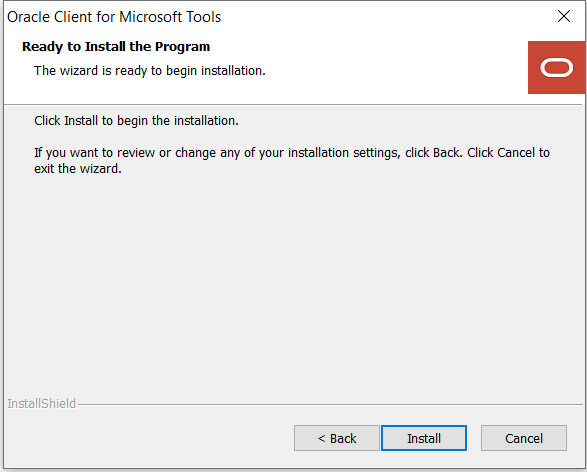


The ODP.NET install is now complete and configured for use on this machine. On the “Wizard Complete” screen, you may review the client README. Click the “Finish” button to proceed.
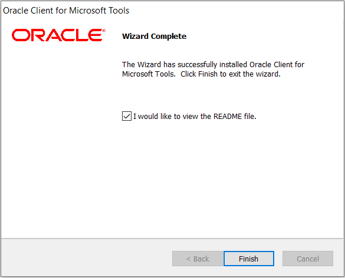

### 32-bit SSAS-Specific Setup

32-bit SSAS requires 32-bit ODP.NET. If you are using 32-bit SSAS, download 32-bit ODAC 19.17 or higher.

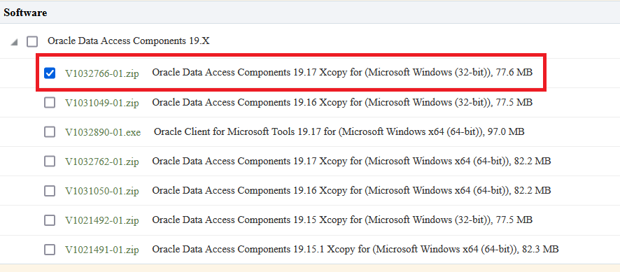

Click the zip file link on the left side to begin the download process. Choose the local directory to download the executable to and click “Save”. You should now see the download locally. 

To install 32-bit ODP.NET, unzip the 32-bit ODAC download contents to a staging directory (e.g., C:\xcopy32-install).  
 
Open a Windows command prompt **in administrator mode**. 

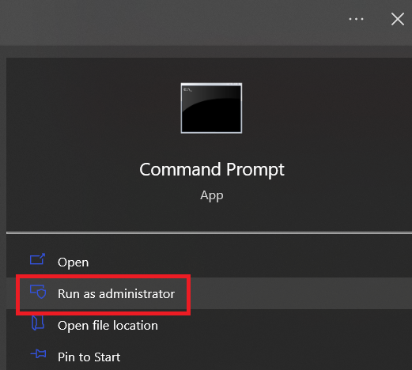

Navigate to the ODAC staging directory in the command prompt, then execute the following command format to install and configure ODP.NET: 
install.bat `<component_name> <oracle_home_path> <oracle_home_name> <install_dependents> <machine_wide_configuration> <tns_admin_location>`
To configure ODP.NET, use the following values:

```
<component_name> = odp.net4
<oracle_home_name> = ODAC install directory, such as C:\oracle
<oracle_home_name> = unique name for the ORACLE HOME, such as myhome
<install_dependents> = true
<machine_wide_configuration> = true
<tns_admin_location> = Oracle database credential files directory, such as C:\data\wallet
```

A sample execution of install.bat with these arguments looks like:
`install.bat  odp.net4  c:\oracle  myhome  true true  c:\data\wallet`

Add the 32-bit Oracle Client directory `(e.g., c:\oracle)` and its bin directory `(e.g., c:\oracle\bin)` to the Windows Path. You can do this by editing the Windows environment variable, `Path`. If the SSAS process runs under the Windows user context, such as Visual Studio, modify the user variables as seen below.


If the SSAS process runs as a Windows service, set the `Path` in the system variables section instead. The system variables section is located below the user variables section.

To ensure these directory path settings have precedence over existing Oracle Homes, move the settings up to the highest possible level in the directory order with the “Move Up” button.

If you are using tnsnames.ora file with your Oracle database, open the tnsnames.ora file to see which ADB or database net service names you can connect to. Below you see three different ones: `“adwptr_high”, “adwptr_low”, and “adwptr_medium”`. You will use one of these values for the SSAS `“Server name”` when configuring your Oracle connection.


 
## Open Visual Studio (VS). 
This tutorial uses VS 2022 screen shots, but the usage experience will be similar for earlier VS versions. 

Create a new “Analysis Services Tabular Project”. Supply a name for the project. 

## Configure the Project

In the Tabular Model Designer, set the Analysis Service instance to “Integrated Workspace” and “SQL Server 2022 / Azure Analysis Services (1600)”. Other compatibility levels work with Oracle database; however, the Oracle connectivity setup experience may differ. Click “Ok”.
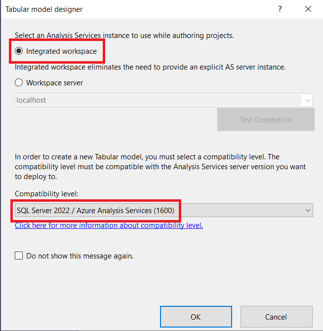

In the Tabular Model Explorer, right-click “Data Sources” and select “New Data Source”.
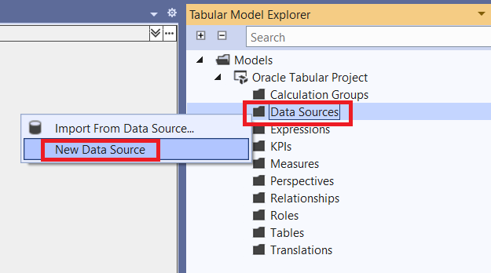

## Test Connection

In the Get Data window, select “Oracle Database”, the click “Connect”.


In the “Server” text box, enter your database net service name (e.g., adwptr_high) from Step 7 or an Easy Connect (Plus) string. Then, click “OK” to connect. 


You will then be requested to enter your database credentials. Select “Database” on the left side of the window. Enter your database user name (e.g., ADMIN) and password. Click the “Connect” button.

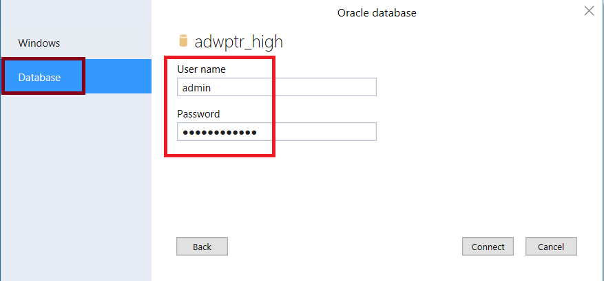
 
In the “Tabular Model Explorer” window, you should now see the Oracle connection under the Data Sources item. Let’s now retrieve the Oracle database schema objects we need to use for our SSAS project. 

Right click the new Oracle data source (e.g., Oracle/adwptr_high). Select “Import New Tables”.
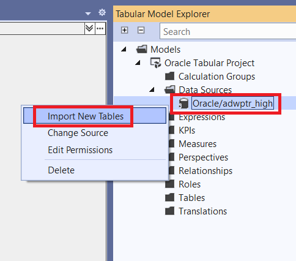

In the Navigator window, you can browse the Oracle database schema for the objects your project will need. Select the schema objects to import. Click “Load’ when done.
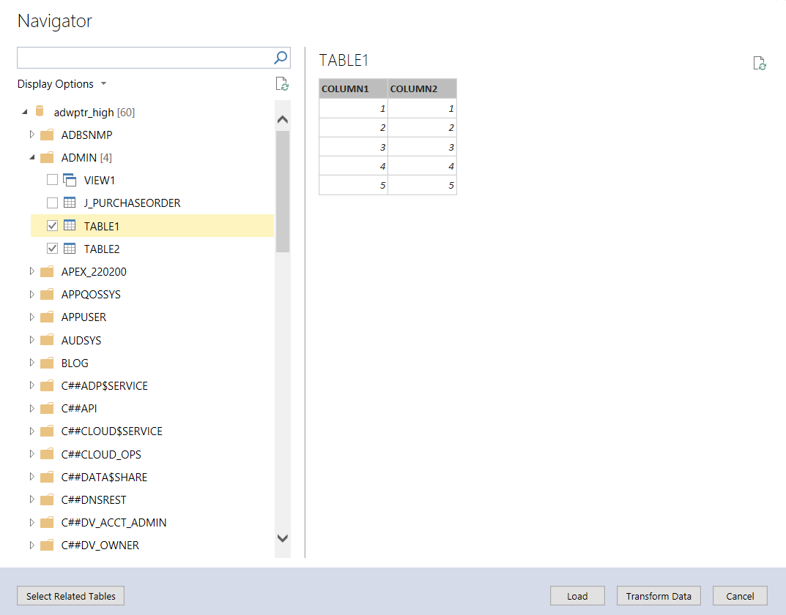

Congratulations! You now have successfully imported Oracle database schema objects into your SSAS project.


## Performance Tuning for Large Data Retrievals 
Typically, BI applications retrieve large data amounts from a source database for further processing. To speed up Oracle data retrieval via SSAS, the ODP.NET FetchSize can be increased from its default 128K value (131,072 bytes) to as large as int.MaxValue. The `FetchSize` determines the amount of data ODP.NET fetches into its internal cache upon each database round trip. It’s possible to improve performance by an order of magnitude by significantly increasing FetchSize when retrieving large result sets. 
 
### Unmanaged ODP. NET Instructions 
To increase the 32-bit or 64-bit unmanaged ODP.NET’s FetchSize, launch the Windows Registry editor (regedit.exe) and go to the following Registry key: 
HKEY_LOCAL_MACHINE\SOFTWARE\Oracle\ODP.NET\4.122.19.1  
 
Add the String Value `"FetchSize"` and set it to a value larger than the default (131072), such as 4194304 (4 MB).  
 
Restart Visual Studio/SSAS and run your queries with the new setting.

## **Acknowledgements**

- **Author(s)** - Pedro Torres, Alex Keh, Database Product Management
- **Contributor(s)** - Blake Hendricks Database Product Management
- **Last Updated By/Date** - Blake Hendricks, February 2023