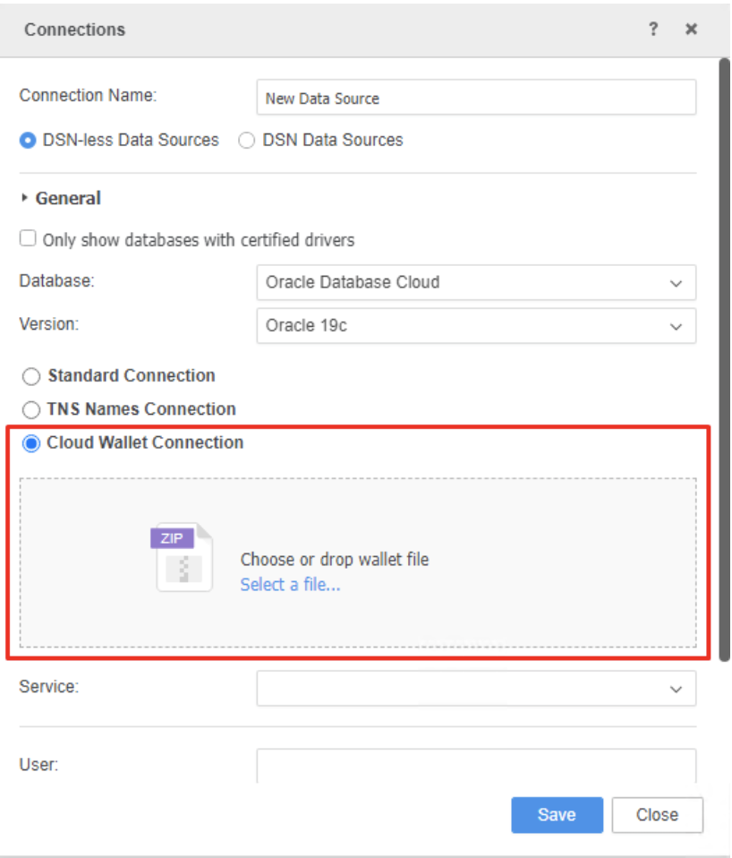

#### **Oracle Database Cloud Connector Adds a New Connection Type to Support Oracle Autonomous Data Warehouse Cloud Wallet Upload in MicroStrategy 2021 Update 3**

This guide shows you how to configure MicroStrategy connectivity to Oracle Autonomous Database (ADB). It describes how to connect Oracle Autonomous Database using the wallet or mTLS.  If you want to connect without the wallet click [here](https://oracle-samples.github.io/adb-connectors/common/tls-no-wallet/workshops/freetier/).

In MicroStrategy 2021 Update 3, the Oracle Database Cloud Connector adds a new connection type called Cloud Wallet Connection to better support Oracle Autonomous Data Warehouse (ADW) on Web and Workstation server mode.

MicroStrategy used to have two connection types, the standard connection and the TNS names connection. If use any of them to connect the ADW, user must manually put the wallet files to the I-server machine disk which is inconvenient and insecure. Especially for MCI and MCE environments, the server access is limited.
Therefore, here comes the cloud wallet connection in MicroStrategy 2021 Update 3. Using the cloud wallet connection, user can simply upload a downloaded [ADW wallet zip file](../common/wallet/wallet.md)) from local to I-server.
To create a Cloud Wallet Connection DB role:

- From Web

Add External Data->Select Oracle Database Cloud->Add new data source

- From Workstation server mode

Datasets->Select project->Select Database Cloud->Add new data source
Click Select a file to upload a wallet zip file from local.

MicroStrategy will also help to parse the ADW service information and return a service list for user selection.
And then the user can select a service to connect, fill in the database username and password.

Click save. Then the new created cloud wallet connection DB role can be used to connect ADW using the wallet file for further analytical process.