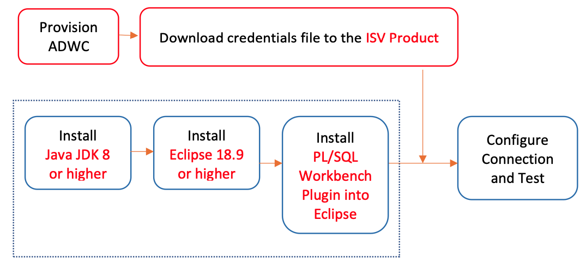
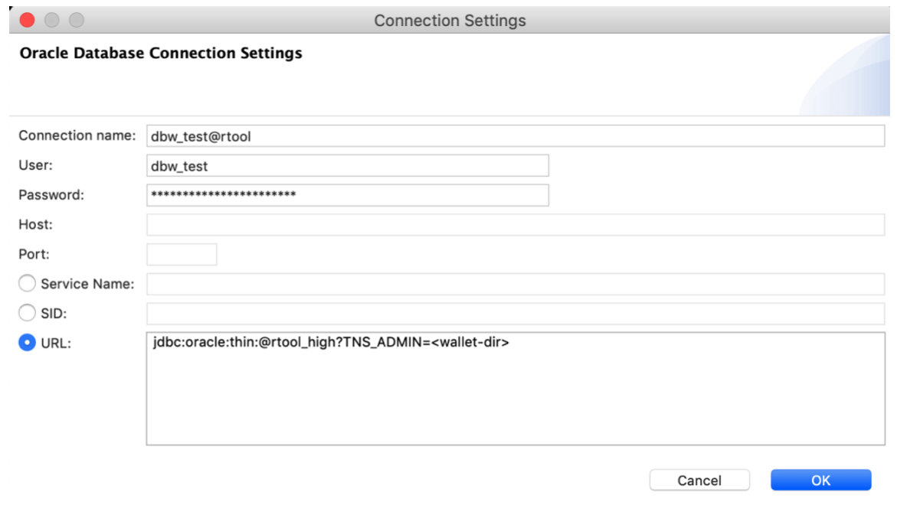

# **Creating a connection from** **PL/SQL Workbench** **to Oracle Autonomous Data Warehouse (ADW)**

Author: Jan Richter / www.jr-database-tools.de **Validation Matrix Version**

This guide shows you how to configure Pl/SQL Workbench connectivity to Oracle Autonomous Database (ADB). It describes how to connect Oracle Autonomous Database using the wallet or mTLS.  If you want to connect without the wallet click [here](https://oracle-samples.github.io/adb-connectors/common/tls-no-wallet/workshops/freetier/).


### **Configuration Steps**




#### **Step 1:** Provision ADWC plus Install and Configure Oracle Client

1. Provision Autonomous Data Warehouse Cloud (ADWC) and download the [Wallet]((../common/wallet/wallet.md) to the system that will have the PL/SQL Workbench installation. For the Oracle documentation to provision ADWC click here. Also check Downloading Client Credentials (Wallets).

2. Autonomous Data Warehouse Cloud use certificate-based authentication Uncompress credentials.zip file into a secure folder.

3. Optional : [Download](../common/instant-client/instant-client-Windows-64.md) the Oracle Database Client to the system where ISV Product is installed. Validate that the Oracle Database Client can communicate with ADWC, and since it is installed on the same system as XXX, it ensures that ISV Product is also configured correctly.

4. Optional : Edit the sqlnet.ora file, replacing “?/network/admin” with the name of the folder containing the client credentials.

   For example:

   

5. Optional : Create the TNS_ADMIN environment variable and set it to the location of the secure folder containing the credentials file you saved in Step 3. The tnsnames.ora file provided with the credentials zip file contains three database service names identifiable as high, medium and low. The predefined service names provide different levels of Autonomous Data Warehouse Cloud. Use one of these servcie names in your ConnectString.
6. Optional : Test the Oracle Client with Oracle SQL*Plus

    ```
    sqlplus password/\"Password\"@ConnectString
    ```

    or

    ```
    sqlplus /nolog
    sql> set define off
    sql> connect username/password@connectString
    ```

If the connection is successful you are ready to move to the next step.


#### Step 2. Configure Connection of **PL/SQL Workbench**

Prerequisites:

- An Oracle Autonomous Database ATP/ADW has been provisioned
- The credentials wallet zip-file has been downloaded und unpacked into a directory.
   (named : <wallet-dir>) (https://docs.oracle.com/en/cloud/paas/atp-cloud/atpug/connect-download- wallet.html#GUID-B06202D2-0597-41AA-9481-3B174F75D4B1)
- Java JDK 8 or higher is installed (https://www.oracle.com/technetwork/java/javase/downloads/index.html).
- Eclipse IDE is installed (https://www.eclipse.org/downloads).
- PL/SQL Workbench has been installed (http://www.jr-database-tools.de/download).

1. Start the Eclipse IDE.

2. Open the PL/SQL Workbench Perspective press on   the global toolbar.

3. Press in PL/SQL Navigator View to open the Connection Dialog.

4. Edit the Connection Settings

   - Edit ‚Connection Name‘, ‚User‘, ‚Password‘ and choose URL

   - Insert the connection settings like using a JDBC connection
      e.g. : jdbc:oracle:thin:@rtool_high?TNS_ADMIN=<wallet-dir>

      

#### Step 3. Using the Connection

- Press  in PL/SQL Navigator View to add a Script Folder with packages, functions, procedures and/or triggers.
- Press  to add new PL/SQL Connectors

    


More Information : www.jr-database-tools.de
