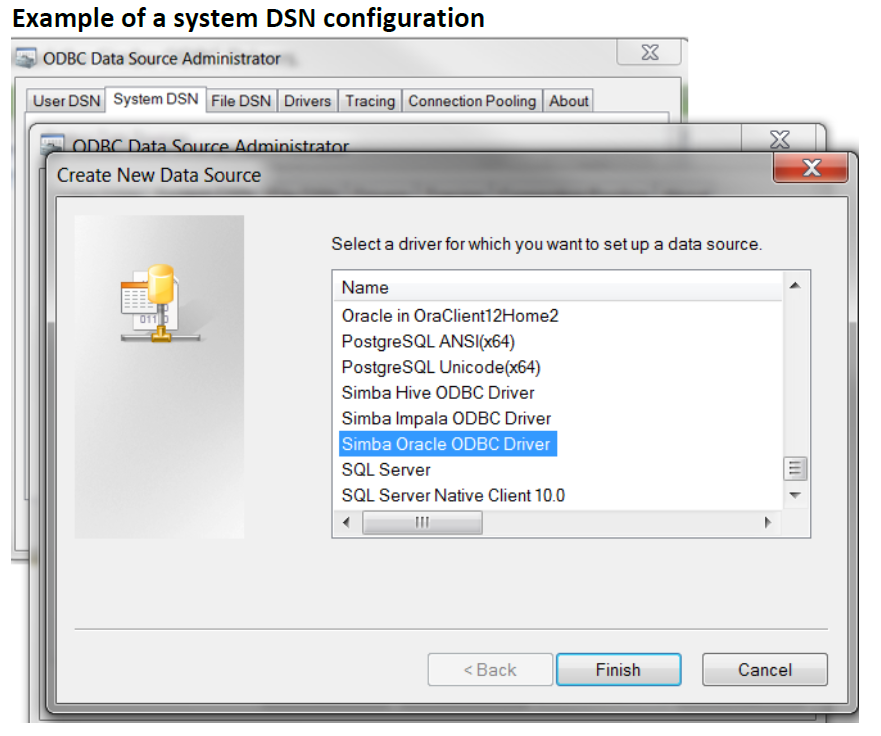
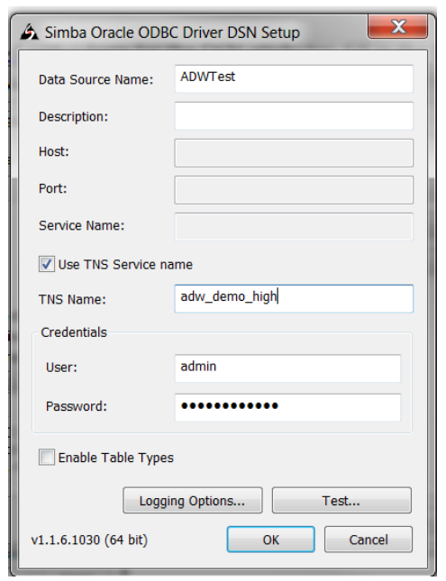
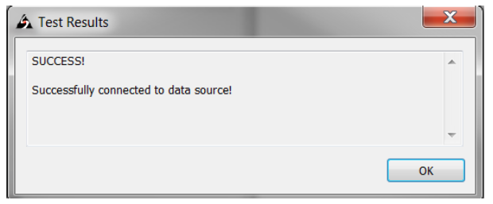

## **Connecting Qlik to Oracle Autonomous Database**

This guide shows you how to configure Qlik connectivity to Oracle Autonomous Database (ADB).  It describes how to connect Oracle Autonomous Database using the wallet or mTLS.  If you want to connect without the wallet click [here](https://oracle-samples.github.io/adb-connectors/common/tls-no-wallet/workshops/freetier/).

These instructions use Oracle Instant Client from Oracle.

## **Prerequisites**

This document assumes the following:

- Autonomous Database (ADB) is provisioned. ADB includes Autonomous Data Warehouse (ADW) or Autonomous Transaction Processing (ATP), or Autonomous JSON Database (AJD).  To provision ADB, see [here](https://docs.oracle.com/en/cloud/paas/autonomous-database/adbsa/autonomous-provision.html#GUID-0B230036-0A05-4CA3-AF9D-97A255AE0C08).
- Qlik is installed on a machine (local, OCI, or other cloud).   
- If you are connecting with ADB Wallet, download it on your machine running Qlik.  To download and configure the wallet see [here](https://docs.oracle.com/en/cloud/paas/autonomous-data-warehouse-cloud/cswgs/autonomous-connect-download-credentials.html#GUID-B06202D2-0597-41AA-9481-3B174F75D4B1).
- If you are not connecting with ADB Wallet, configure ADB with TLS [here](https://blogs.oracle.com/developers/post/securely-connecting-to-autonomous-db-without-a-wallet-using-tls).
- Oracle Instant Client is downloaded and configured.  To install Oracle Instant Client see [here](https://www.oracle.com/database/technologies/instant-client.html).

## **Configuring Qlik with Oracle Client**

Qlik recommends downloading and using the Qlik ODBC Connector Package to connect
to ADB. Complete information about how to download, install and create a system
DSN is available on Qlik website [here](https://help.qlik.com/en-US/connectors/Subsystems/ODBC_connector_help/Content/Connectors_ODBC/Introduction/ODBC-connector.htm).

ADB is a secured service and therefore encryption of network traffic is required. Qlik relies on Oracle Instant Client or an Oracle Client for that purpose.

Follow the Simba Configuration document to configure a system DSN on the Server.

Note: A direct TNS connection without using the Qlik ODBC Connector is also possible
but Qlik recommends using the ODBC Connector based connection to connect to an
ADB service.

1. From the ODBC Data Source Administrator, Click on the Add button and choose the Simba
   Oracle ODBC Driver which is part of the Qlik ODBC Connector Package.

2. Fill in the Data Source Name, DSN, your TNS name is the Oracle net service name, this can be found in the tnsnames.ora file.   More information on connecting to ADB from Qlik is located [here](https://help.qlik.com/en-US/connectors/Subsystems/ODBC_connector_help/Content/Connectors_ODBC/Oracle/Create-Oracle-connection.htm).  Qlik documents that the tnsname.ora and sqlnet.ora should be place in the following for Qlik Sense and QlikView:

   Qlik Sense Desktop:

   %USERPROFILE%\AppData\Local\Programs\Common Files\Qlik\Custom Data\QvOdbcConnectorPackage\oracle\lib\network\admin

   Qlik Sense Enterprise:

   C:\Program Files\Common Files\Qlik\Custom Data\QvOdbcConnectorPackage\oracle\lib\network\admin

   QlikView:

   C:\Program Files\Common Files\QlikTech\Custom Data\QvODBCConnectorPackage\oracle\lib\network\admin

3. You can also test the connection here before saving it.

You are now ready to consume this system DSN in Qlik Sense Desktop.

## **Acknowledgements**

* **Author(s)** - Vijay Balebail, Milton Wan, Database Product Management
* **Contributor(s)** -
* **Last Updated By/Date** - Milton Wan, December 2022
