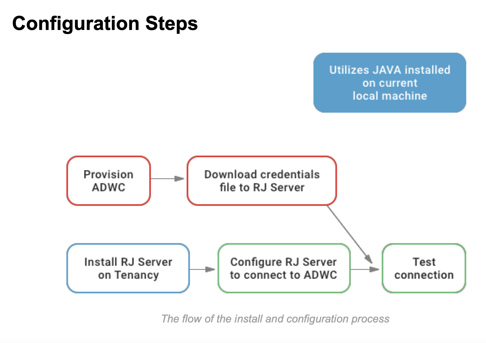
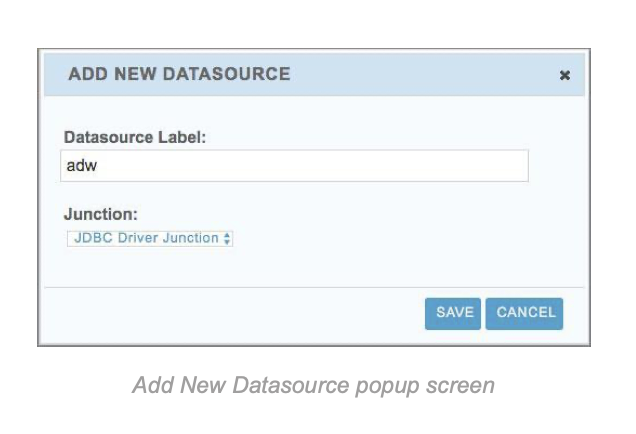
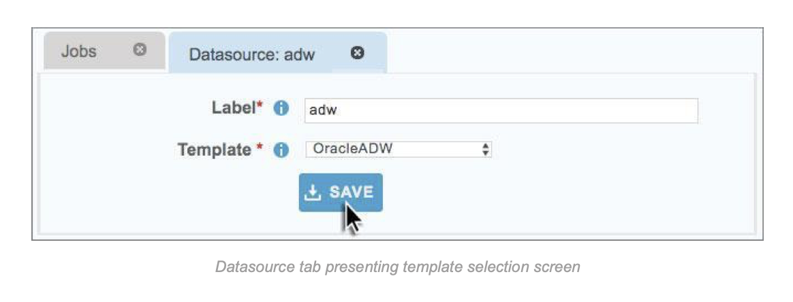
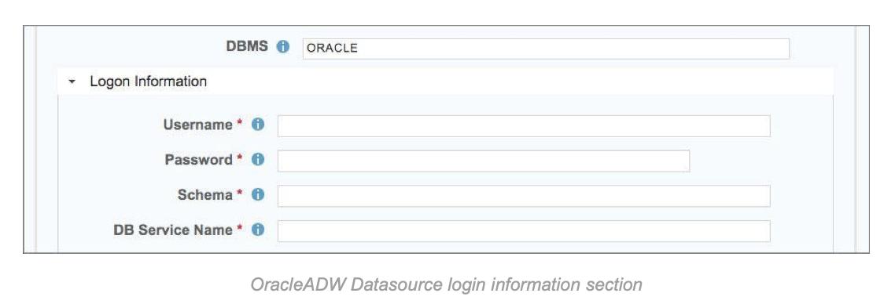
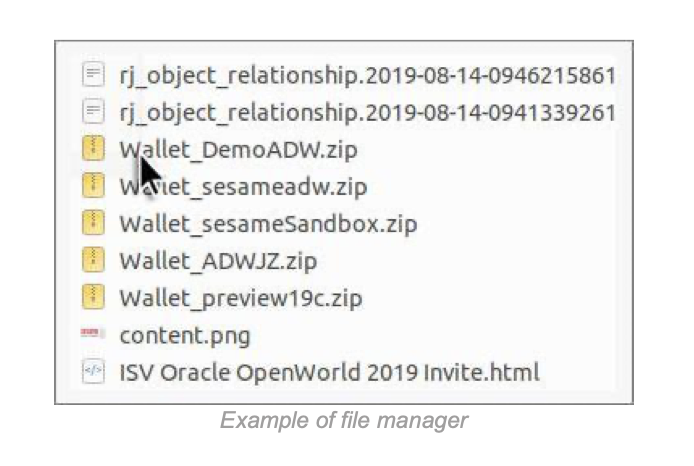
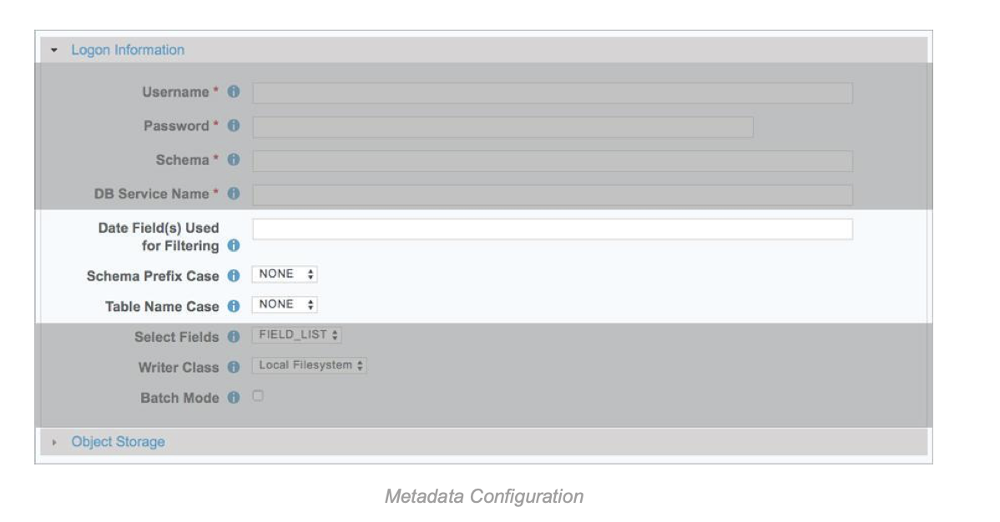

# **Creating a Connection from Relational Junction to Oracle Autonomous Data Warehouse (ADW)**

This guide shows you how to configure Relational Junction connectivity to Oracle Autonomous Database (ADB). It describes how to connect Oracle Autonomous Database using the wallet or mTLS.  If you want to connect without the wallet click [here](https://oracle-samples.github.io/adb-connectors/common/tls-no-wallet/workshops/freetier/).

### **Step 1: Provisioning the ADWC Instance and Installing and Configuring the Oracle Client**

Provision Autonomous Data Warehouse Cloud (ADWC) and download the [Wallet](../common/wallet/wallet.md) to the system that will have the Relational Junction server installation. To retrieve the Oracle documentation on provisioning ADWC, click [here](https://docs.oracle.com/en/cloud/paas/autonomous-database/index.html). Also, check out more information on Downloading Client Credentials [Wallets](https://docs.oracle.com/en/cloud/paas/autonomous-database/adbsa/connect-download-wallet.html#GUID-B06202D2-0597-41AA-9481-3B174F75D4B1).

### **Step 2. Install** Relational Junction

For pre-existing Relational Junction installations, jump to Step 3, which details the steps needed to configure ADWC as a target.

If this is a new installation, use the following steps:

1) Purchase Relational Junction:
    a) from the Sesame Software website https://sesamesoftware.com/request-a-demo/

​		b) or on the Oracle Cloud Marketplace

​			https://cloudmarketplace.oracle.com/marketplace/en_US/listing/53395658

​		c) or on the Oracle Cloud Marketplace BYOL Listing

​			https://cloudmarketplace.oracle.com/marketplace/en_US/listing/65298773

2) Registertheproductwithourcompany.
3) Contact our Support department at support@sesamesoftware.com  for installation and setup assistance that you may require.

### **Step 3: Configuring Relational Junction’s Datasource** **to Connect with ADWC**

1) After installation,configure the product to connect to the ADW data source and your selected target. Start by clicking on the Datasources tab. Then click on New Datasource to bring up the Add New Datasource popup screen.

2. Give the data source a meaningful label to help you identify it.
3. Choose the JDBC Driver Junction option from the drop down menu.
4. Save the new datasource.

5. When the configuration page opens, choose the Oracle ADW option from the drop down menu.
6. Then click on the Save button.

7. After choosing the Oracle ADW template, enter the required credentials for ADW instance:

​		a) Enter the ADW Username that will be used. 

​		b) Enter the ADW Password that will be used.

​        c) Enter the name of the schema thatis going to be used for this data source. 

​		d) Enter the DB Service Name being used.

8) Choose one of the following Temporary Storage Locations (a or b): 

​		a) Local file system storage 

​				i) If you are using local filesystem storage, go directly to step 9. 

​		b) Object Storage 

​				i) Add credentials: 

​						(1) Enter the User OCID (Oracle Cloud Id), e.g., ocid1.user.oc1..aaaaaaaas______o3r 

​						(2)  Paste in the Private Key that was generated on your system to allow you to get the 							   authtoken. 

​						(3)  Tenancy - Paste or enter your OCID, e.g., ocid1.tenancy.oc1..aaaaaaaab______dsq 

​						(4)  Region - This is the physical location where the instance resides, e.g., “Phoenix” or “Ashburn” 

​						(5)  Passphrase - If securing the Private Key with a Passphrase, enter it here 

​						(6)  Fingerprint - Verifies the Private Key that you entered, e.g., 20:3b:97:13:55:1c:5b:0d:d3:37:d8:50:4e:c5:3a:34 

​						(7)  Compartment - Paste or enter your OCID, e.g., ocid1.compartment.oc1..aaaaaaaas______o3r 

​						(8)  Authtoken - Encoded string for 2 factor authentication 

​						(9)  OCI Username - Oracle Cloud Username

​						(10) Continue to step 9. 

9) ClickonFileWizard.

10) Click on the Choose File button to bring up the screen to pick a file.

​			a) ChoosetheWalletfilethatyouwillbeusing,e.g.,Wallet_Demo_ADW.zip

11) Click on the Upload button to add the Wallet file you want to use.

12) Put the name of the Wallet file in the Wallet Location section.

​		a) e.g.,Wallet_Demo_ADW

​		b) IfthereisapasswordrequiredfortheWallet,thatcanalsobeenteredon the next line.

13) Enter the name of the Date Field, or Fields, that you wish to key the incremental downloads on.

14) Set Schema Prefix to upper. 
15) Set Table Name case to upper.

16) Click Test.

17) You should see a message that says Connection Test Successful.

18) Click Save And Close.

## **Acknowledgements**

* **Author(s)** - William Dubberley, Rebecca Wyatt, George Weilenmann, Scott O’Dell
* **Contributor(s)** - Kirk Gustafson
* **Last Updated By/Date** - Kirk Gustafson, April 2023