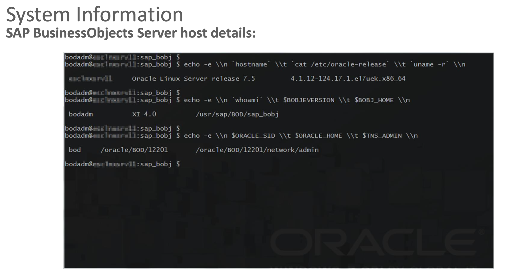
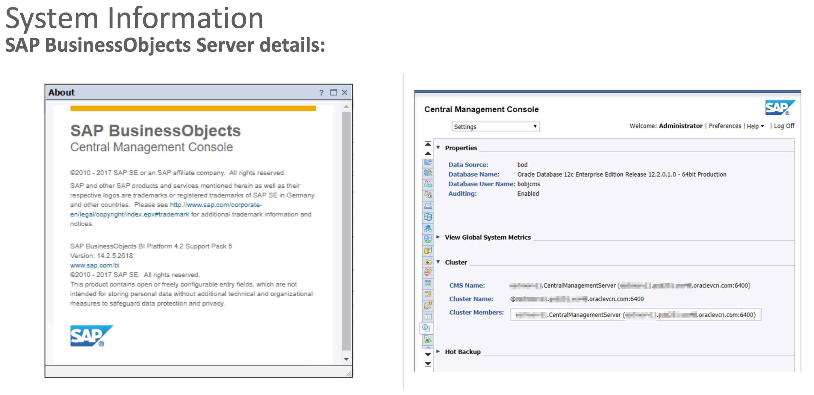
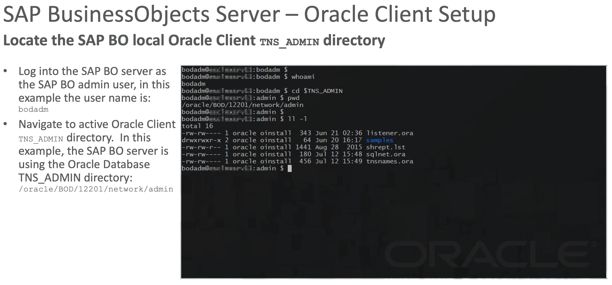
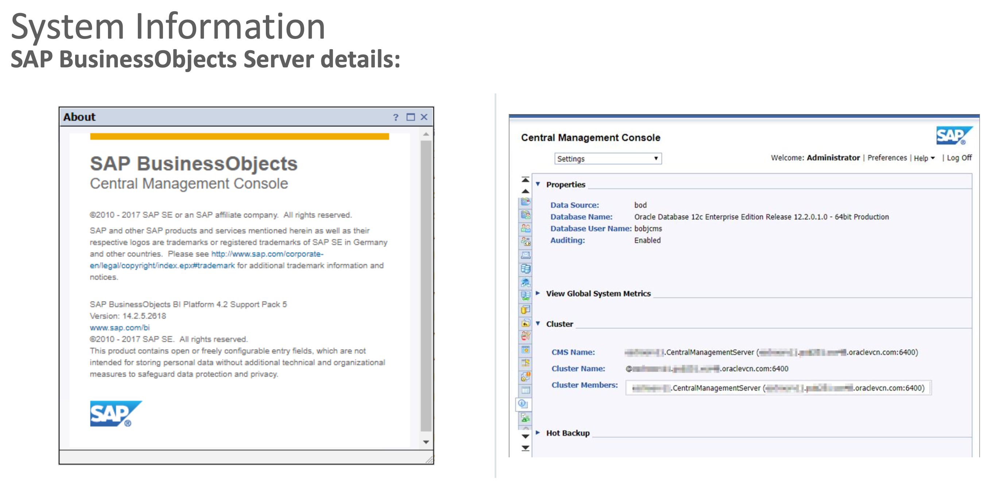
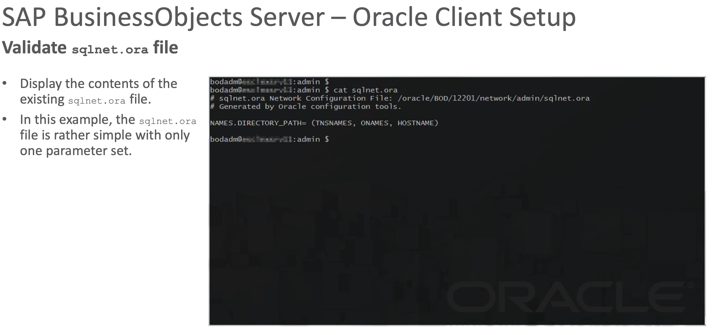
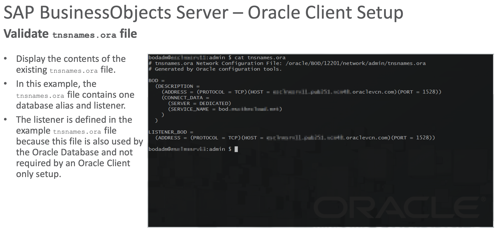
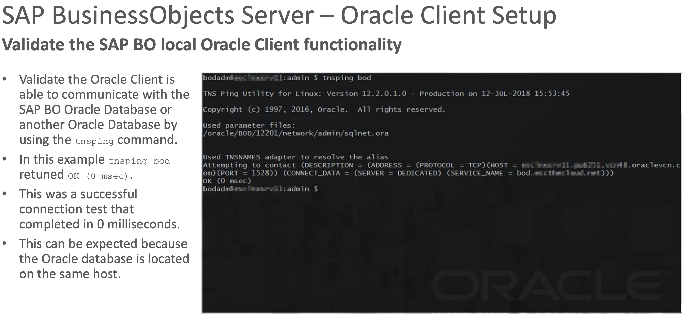
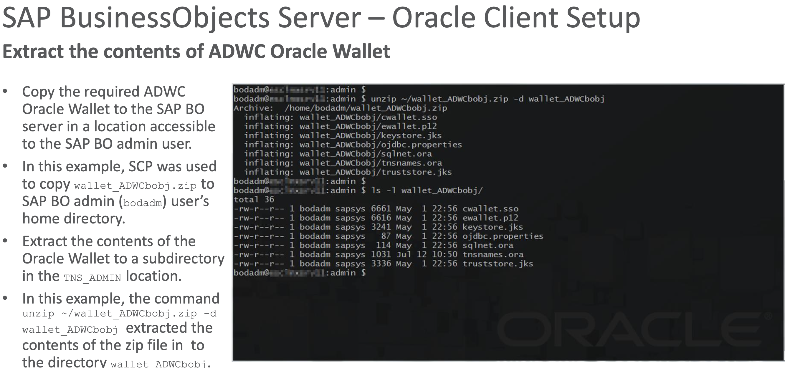
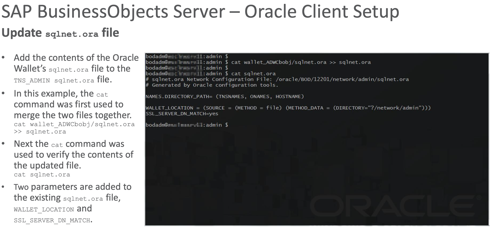
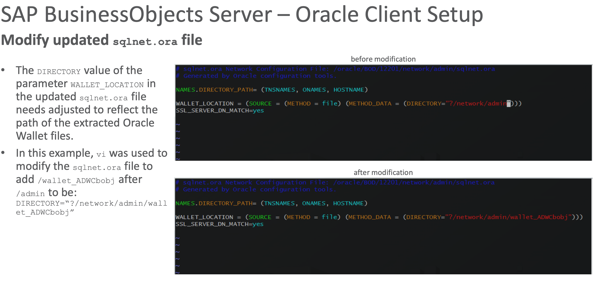

# SAP BusinessObjects

### **Connecting to the Oracle Autonomous Data Warehouse Service using an Oracle Wallet**

#### Table of Contents

1. Introduction

2. SAP BusinessObjects Server – Oracle Client Setup

3. Windows Desktop – Oracle Client Setup

4. Creating and Publishing a SAP BusinessObjects

5. Universe Report Creation with Crystal Reports

6. Report Creation with Web Intelligence

7. References

#### Introduction

This guide shows you how to configure SAP Business Objects connectivity to Oracle Autonomous Database (ADB). It describes how to connect Oracle Autonomous Database using the wallet or mTLS.  If you want to connect without the wallet click [here](https://oracle-samples.github.io/adb-connectors/common/tls-no-wallet/workshops/freetier/).

 The primary focus is to validate the ability to use Oracle Wallet, required by ADW, to make a secure connection to an Oracle Database. This guide illustrations how to create a simple SAP BO Universe relying on the Oracle Call Interface (OCI), not to be confused with Oracle Cloud Infrastructure (OCI), as the driver for the connection. This document is by no means is the only way to achieve connectivity to ADW from SAP BO, it is just one example.

This walkthrough is not intended to be a detailed SAP BO reporting guide. The reporting examples simply demonstrate how to create very basic reports utilizing Crystal Reports and Web Intelligence.

#### Basic Skills

This guide relies on some basic skills necessary to configure the Oracle Client and use of SAP BO. This guide should provide the details needed to successfully complete the entire process of connecting SAP BusinessObjects to Oracle Autonomous Data Warehouse.

Required skills and tool knowledge:
 – Connecting to Linux a host and the ability to transfer files. (i.e. ssh & scp)
 – Navigating in a Linux server environment and a Windows desktop.
 – Oracle Client concepts (ORACLE_HOME & TNS_ADMIN) and tools (sqlplus & tnsping). – Oracle Database query understanding. (i.e. tables, columns & SQL)
 – Use of text editors on both Linux and Windows. (i.e. vi & notepad)

#### Pre-Requirements

There are certain requirements necessary for this guide to be successful and are listed below:

– SAP BusinessObjects Server and application login credentials.
 • Access to the Central Management Console (http://*<hostname>*:8080/BOE/CMC).

• Access to the BI Launch Pad (http://*<hostname>*:8080/BOE/BI).
 • A Windows desktop with client development tools for SAP BusinessObjects.

– SAP BusinessObjects Sever administrator operating system access.

– An Oracle 12.2+ Client installed on SAP BusinessObjects server and Windows desktop.

– [ADW Oracle Wallet and login credentials](../common/wallet/wallet.md)

## **Acknowledgements**

* **Author(s)** - Erick Carlson, SAP Solution Architect, North America, SAP on Oracle Team (August 2018)
* **Contributor(s)** - Kirk Gustafson
* **Last Updated By/Date** - Kirk Gustafson, April 2023
