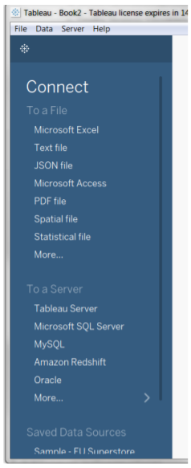
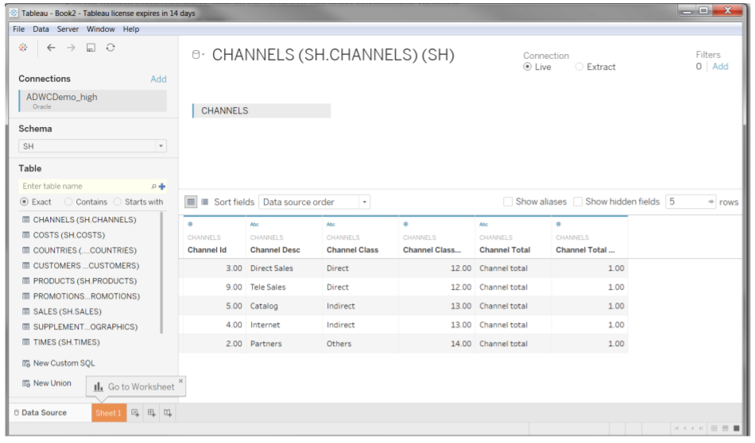

## **Connecting Tableau to Oracle Autonomous Database**


This guide shows you how to configure Tableau Desktop/Server connectivity to Oracle Autonomous Database (ADB).  It describes how to connect Oracle Autonomous Database using the wallet or mTLS.  If you want to connect without the wallet click [here](https://oracle-samples.github.io/adb-connectors/common/tls-no-wallet/workshops/freetier/). These instructions use Oracle Instant Client from Oracle.

## **Prerequisites**

This document assumes the following:

- Tableau Desktop/Server is installed on a machine (local, OCI, or other cloud).  
- Autonomous Database (ADB) is provisioned. ADB includes Autonomous Data Warehouse (ADW) or Autonomous Transaction Processing (ATP), or Autonomous JSON Database (AJD).  To provision ADB, see [here](https://docs.oracle.com/en/cloud/paas/autonomous-database/adbsa/autonomous-provision.html#GUID-0B230036-0A05-4CA3-AF9D-97A255AE0C08).
- ADB Wallet is downloaded on your machine running Tableau.  To download and configure the wallet see [here](https://docs.oracle.com/en/cloud/paas/autonomous-data-warehouse-cloud/cswgs/autonomous-connect-download-credentials.html#GUID-B06202D2-0597-41AA-9481-3B174F75D4B1).
- Oracle Instant Client is downloaded and configured.  To install Oracle Instant Client see [here](https://www.oracle.com/database/technologies/instant-client.html).
- You also need `ojdbc8.jar` and the additional jars: `oraclepki.jar`, `osdt_core.jar`, and `osdt_cert.jar` for use with Oracle wallets, see [here](https://www.oracle.com/database/technologies/appdev/jdbc-downloads.html) and download ojdbc8-full.tar.gz.
  - Extract `ojdbc8.jar`, `oraclepki.jar`, `osdt_core.jar`, and `osdt_cert.jar` to the `Tableau/Drivers` directory and restart Tableau.


## **Configuring Tableau with Oracle Client**

Tableau Desktop/Server connects to Oracle Database using TCP connectivity from the Oracle Client. Tableau uses the Oracle Easy Connect method.

Before Tableau can use the Oracle Client, the system environment variable, `TNS_ADMIN`, needs to be set up. Typically `TNS_ADMIN` is set to  `<ORACLE_HOME>/Network/Admin` directory where your tnsnames.ora file is located.  

1. Test to make sure that your `TNS_ADMIN` environment variable is set correctly. Open
   up a CMD prompt and issue the following command `echo %TNS_ADMIN%`. The example
   output of the command should produce a valid directory pathway to the
   `TNS_ADMIN` directory where tnsnames.ora is located.


    ```
    C:\Users> echo %TNS_ADMIN%
    C:\app\client\product\19.3.0\client_1\network\admin
    ```

2. Open the tnsames.ora file in the ...\network\admin directory and locate the service name you want to use for your ADB service.  Here is an example of the tnsnames.ora entries from the unzipped ADB wallet.

    ```
    ADWCDemo_high = (description= (address=(protocol=tcps)(port=1522)(host=adwc.uscomeast1.oraclecloud.com))(connect_data=(service_name=yk2ddvkx2pyiekt_virtualitydemo_high.a
    dwc.oraclecloud.com))(security=(ssl_server_cert_dn=
    "CN=adwc.uscom-east-1.oraclecloud.com,OU=Oracle BMCS US,O=Oracle
    Corporation,L=Redwood City,ST=California,C=US")) )

    ADWCDemo_low = (description= (address=(protocol=tcps)(port=1522)(host=adwc.uscomeast1.oraclecloud.com))(connect_data=(service_name=yk2ddvkx2pyiekt_virtualitydemo_low.ad
    wc.oraclecloud.com))(security=(ssl_server_cert_dn=
    "CN=adwc.uscom-east-1.oraclecloud.com,OU=Oracle BMCS US,O=Oracle
    Corporation,L=Redwood City,ST=California,C=US")) )

    ADWCDemo_medium = (description=
    (address=(protocol=tcps)(port=1522)(host=adwc.uscom-east1.oraclecloud.com))(connect_data=(service_name=yk2ddvkx2pyiekt_virtualitydemo_mediu
    m.adwc.oraclecloud.com))(security=(ssl_server_cert_dn=
    "CN=adwc.uscom-east-1.oraclecloud.com,OU=Oracle BMCS US,O=Oracle
    Corporation,L=Redwood City,ST=California,C=US")) )
    ```

    ```
    C:\Users> echo %TNS_ADMIN%
    C:\app\client\product\19.3.0\client_1\network\admin
    ```

2. Open the tnsames.ora file in the ...\network\admin directory and locate the service name you want to use for your ADB service.  Here is an example of the tnsnames.ora entries from the unzipped ADB wallet.

    ```
    ADWCDemo_high = (description= (address=(protocol=tcps)(port=1522)(host=adwc.uscomeast1.oraclecloud.com))(connect_data=(service_name=yk2ddvkx2pyiekt_virtualitydemo_high.a
    dwc.oraclecloud.com))(security=(ssl_server_cert_dn=
    "CN=adwc.uscom-east-1.oraclecloud.com,OU=Oracle BMCS US,O=Oracle
    Corporation,L=Redwood City,ST=California,C=US")) )

    ADWCDemo_low = (description= (address=(protocol=tcps)(port=1522)(host=adwc.uscomeast1.oraclecloud.com))(connect_data=(service_name=yk2ddvkx2pyiekt_virtualitydemo_low.ad
    wc.oraclecloud.com))(security=(ssl_server_cert_dn=
    "CN=adwc.uscom-east-1.oraclecloud.com,OU=Oracle BMCS US,O=Oracle
    Corporation,L=Redwood City,ST=California,C=US")) )

    ADWCDemo_medium = (description=
    (address=(protocol=tcps)(port=1522)(host=adwc.uscom-east1.oraclecloud.com))(connect_data=(service_name=yk2ddvkx2pyiekt_virtualitydemo_mediu
    m.adwc.oraclecloud.com))(security=(ssl_server_cert_dn=
    "CN=adwc.uscom-east-1.oraclecloud.com,OU=Oracle BMCS US,O=Oracle
    Corporation,L=Redwood City,ST=California,C=US")) )
    ```

3. Open Tableau and Choose Oracle as a data source under the ‘To a
   Server’ section.

   


4. In the connection screen for Oracle, use the service name from the tnsnames.ora in the Server field. The Service and Port are not required because it is described already from service name.  Select Use a username and password and provide the database username and the password and click Sign In.  SSL box is not checked.

    

    You are now ready to analyze/visualize.

    


## **Acknowledgements**

* **Author(s)** - Milton Wan, Database Product Management
* **Contributor(s)** - Blake Hendricks, Database Product Management
* **Last Updated By/Date** - Blake Hendricks, Database Product Management June 2022
